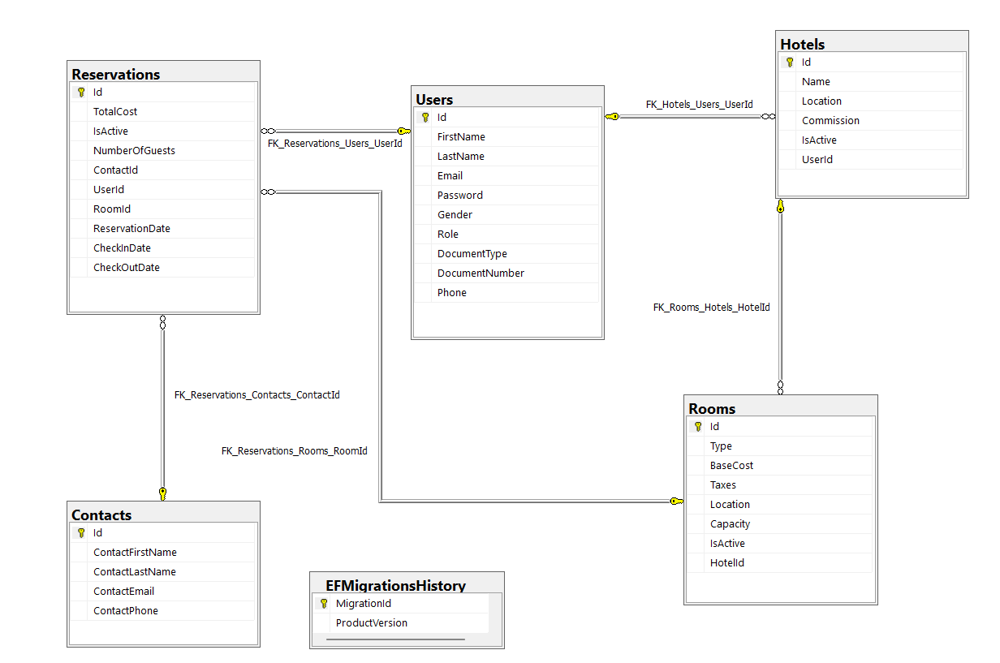

# TravelAPI
### TravelAPI is a RESTful API that provides endpoints to manage hotel reservations. This project was built using ASP.NET Core 6.0, and it uses a SQL Server database to store information about hotels, rooms, users, and reservations.
---

- [TravelAPI](#travelapi)
    - [TravelAPI is a RESTful API that provides endpoints to manage hotel reservations. This project was built using ASP.NET Core 6.0, and it uses a SQL Server database to store information about hotels, rooms, users, and reservations.](#travelapi-is-a-restful-api-that-provides-endpoints-to-manage-hotel-reservations-this-project-was-built-using-aspnet-core-60-and-it-uses-a-sql-server-database-to-store-information-about-hotels-rooms-users-and-reservations)
  - [1. Installation](#1-installation)
  - [2. Configuration](#2-configuration)
  - [3. Usage](#3-usage)
  - [4. Dependencies](#4-dependencies)
  - [5. Directory Structure](#5-directory-structure)
  - [6. Database Diagram](#6-database-diagram)


## 1. Installation
To use this API, you will need to have Visual Studio 2022 installed on your machine. You can download it from the [<u>official website</u>](https://visualstudio.microsoft.com/downloads/).

Once you have Visual Studio installed, follow these steps:

1. Clone the repository from GitHub: git clone https://github.com/jpmarint/TravelAPI.git
2. Open the solution file (TravelAPI.sln) in Visual Studio.
3. Restore the NuGet packages by right-clicking on the solution in the Solution Explorer and selecting "Restore NuGet Packages".
4. Update the appsettings.json file with your SMTP server details (see "Configuration" section below).
5. Change the server name in the optionsBuilder.UseSqlServer method in the DataContext.cs file to match your SQL Server instance.
6. Build and run the project using Visual Studio.


## 2. Configuration
The appsettings.json file contains configuration settings for the API. You will need to update the MailSettings section with your SMTP server details:

`appsettings.json`
```
"MailSettings": {
  "Mail": "<fromemail>",
  "DisplayName": "<displayname>",
  "Password": "<yourpasswordhere>",
  "Host": "smtp.gmail.com",
  "Port": 587
}
```


## 3. Usage
Once the API is up and running, you can use a tool like [Swagger](https://swagger.io/) to explore the available endpoints. The Swagger documentation can be found at:
`https://localhost:7126/swagger` or `https://localhost:5224/swagger`.


## 4. Dependencies
This project depends on the following NuGet packages:

- AutoMapper
- AutoMapper.Extensions.Microsoft.DependencyInjection
- Microsoft.AspNetCore.OpenApi
- Microsoft.EntityFrameworkCore
- Microsoft.EntityFrameworkCore.Design
- Microsoft.EntityFrameworkCore.SqlServer
- Microsoft.EntityFrameworkCore.Tools
- NETCore.MailKit
- Microsoft.VisualStudio.Web.CodeGeneration.Design
- Swashbuckle
- Swashbuckle.AspNetCore
- Swashbuckle.AspNetCore.Swagger
- Swashbuckle.AspNetCore.SwaggerGen
- Swashbuckle.AspNetCore.SwaggerUI

All dependencies can be installed using the command at your `terminal` inside the file directory:
```
dotnet restore
```
Alternatively, you can also use the Visual Studio user interface to restore the dependencies. You can open the `Package Manager Console` window in Visual Studio, and then use the `Update-Package` command to restore the packages and dependencies for the project or solution.

To open the `Package Manager Console` window, go to the Tools menu in Visual Studio and select `NuGet Package Manager` > `Package Manager Console`. Once the `Package Manager Console` window is open, you can use the `Update-Package` command to restore the packages and dependencies, like this:
```
Update-Package -reinstall
```

## 5. Directory Structure
The project directory structure is as follows:
```
TravelAPI
    │   appsettings.Development.json
    │   appsettings.json
    │   Program.cs
    │   TravelAPI.csproj
    │   TravelAPI.csproj.user
    │
    ├───Controllers
    │       HotelController.cs
    │       ReservationsController.cs
    │       RoomController.cs
    │       UserController.cs
    │
    ├───Data
    │       DataContext.cs
    │
    ├───DTO
    │   ├───Hotel
    │   │       CreateHotelDto.cs
    │   │       HotelAvailabilityDto.cs
    │   │       ShowHotelDto.cs
    │   │       ShowHotelToTravelerDto.cs
    │   │       UpdateHotelDto.cs
    │   │
    │   ├───Reservation
    │   │       CreateReservationDto.cs
    │   │       ShowReservationDto.cs
    │   │       UpdateReservationDto.cs
    │   │
    │   ├───Room
    │   │       RoomAvailabilityDto.cs
    │   │       ShowRoomDto.cs
    │   │       UpsertRoomDto.cs
    │   │
    │   └───User
    │           CreateUserDto.cs
    │           ShowUserDto.cs
    │           UpdateUserDto.cs
    │
    ├───Migrations
    │       20230328204309_InitialMigration.cs
    │       20230328204309_InitialMigration.Designer.cs
    │       20230329174311_HotelCorrection.cs
    │       20230329174311_HotelCorrection.Designer.cs
    │       DataContextModelSnapshot.cs
    │
    ├───Models
    │       Contact.cs
    │       Hotel.cs
    │       MailRequest.cs
    │       MailSettings.cs
    │       Reservation.cs
    │       Room.cs
    │       User.cs
    │
    ├───Properties
    │       launchSettings.json
    │
    └───Utils
            AutoMapperProfile.cs
            IMailSendService.cs
            MailSendService.cs
```

## 6. Database Diagram
